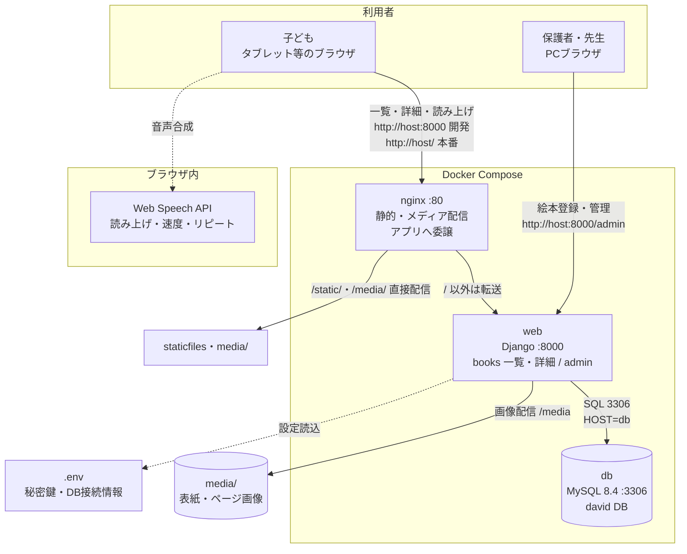

# David アーキテクチャ

## 構成要素

| 要素 | 役割 |
|---|---|
| `web`（Django） | 絵本一覧 `/`、詳細 `/books/<id>/`、管理 `/admin/`、読み上げUI配信。開発はrunserver、本番はgunicorn（`compose.prod.yaml` で切替） |
| `nginx` | 入口（:80）。`/static/`・`/media/` を直接配信し、アプリ処理のみ `web:8000` へ転送 |
| `db`（MySQL 8.4） | `Book`・`Page`・認証等の永続化（`david` DB） |
| `media/` | 表紙（`covers/`）・ページ画像（`pages/`）の保存・配信 |
| Web Speech API | ブラウザ標準の英文読み上げ（速度・リピート・日訳表示切替） |
| `.env` | `DJANGO_SECRET_KEY`・DB接続情報をホストとコンテナで共有（Git管理外） |

## データの流れ

1. 保護者が `/admin/` で絵本・ページ（日英テキスト・画像）を登録 → `db` に保存
2. 子どもが `/` で絵本を選択 → `/books/<id>/` で本文・画像を表示
3. 「よみあげる」ボタン → ブラウザのWeb Speech APIが英文を音声再生

## ポート

| 公開 | 用途 |
|---|---|
| `8000` | web直結（開発用） |
| `80` | nginx経由（静的配信あり・本番想定） |
| `3306` | db（ホストからの直接接続・管理用） |

## 開発時の別形態

ホスト直実行も可能：ホストの `runserver` ＋ `MYSQL_HOST=127.0.0.1` で、PC上のMySQL（`.env` の `MYSQL_PORT`）に接続する。
コンテナ実行時は `MYSQL_HOST=db` が優先され、コンテナ間接続になる。
